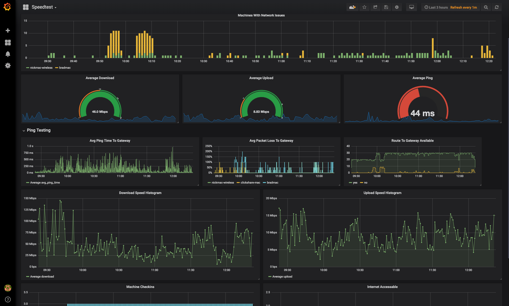

# Internet Speedtest Script
A quick and dirty script that can be ran to determine the speed of your internet connection. 

Using this with `docker-compose` will spin up 3 containers, and `filebeat` will send our logs to an Elasticsearch cluster of your choice for futher study. 

Included is a `grafana dashbaoard` file (`grafana-dashboard.json`) which can be easily loaded into Grafana for quick and easy deployment.  

For best results, this was tested and built with [ELK In a Box](https://github.com/nickmaccarthy/elk-in-a-box), a pre build elasticsearch, kibana and logstash environment (which includes Grafana as well).  

# Usage
1. Install Docker along with docker-compose
2. copy `env.example` to `.env` (`cp env.example .env`), and fill in all relevant info in this file and save it
    * `machine_name` - name of your machine as you want it to show up against the dashboard
    * `es_hosts` - IP(s) or hostname(s) of the Elasticsearch hosts to send your data to 
    * `ping_hosts` - IP or Hostname of the host to ping agsinst for the ping container
3. Run `docker-compose up` , ensure everything is working.  
    * To run this in the background, simply run docker compose in daemon mode `docker-compose up -d` 

# Grafana Dashboard
A Grafana dashboard is available for you with `grafana-dashboard.json` (simply import this into your own grafana).

